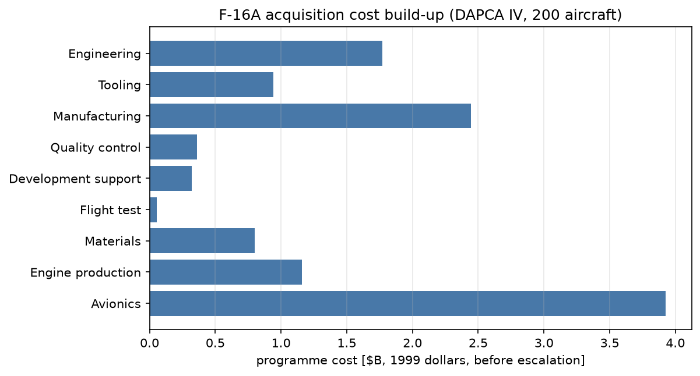
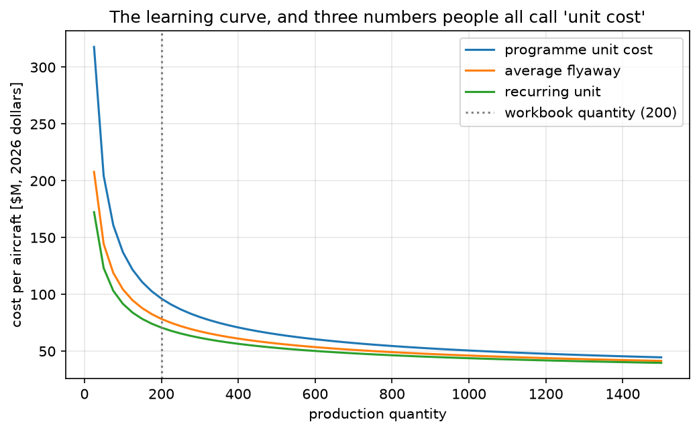
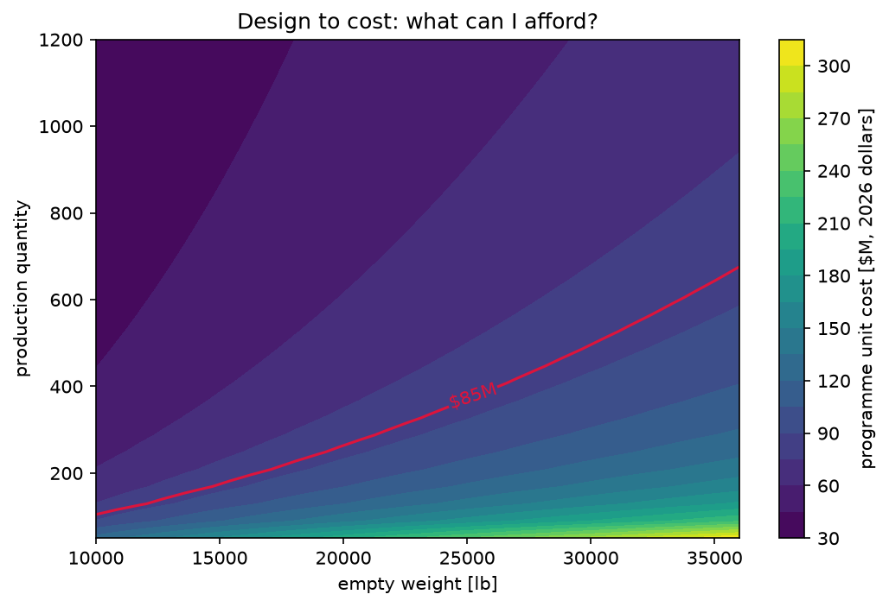
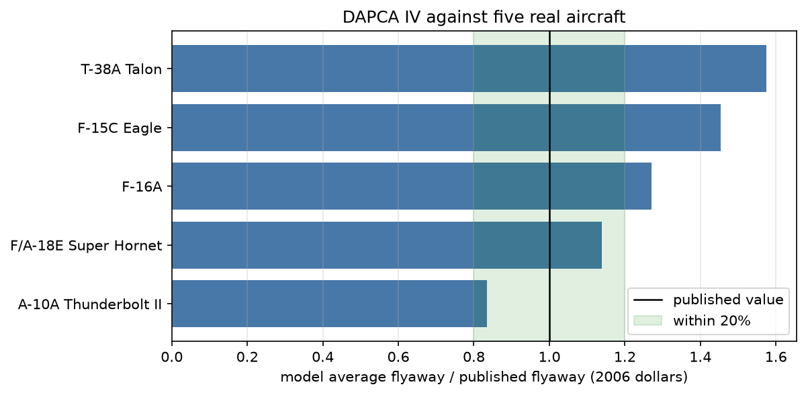
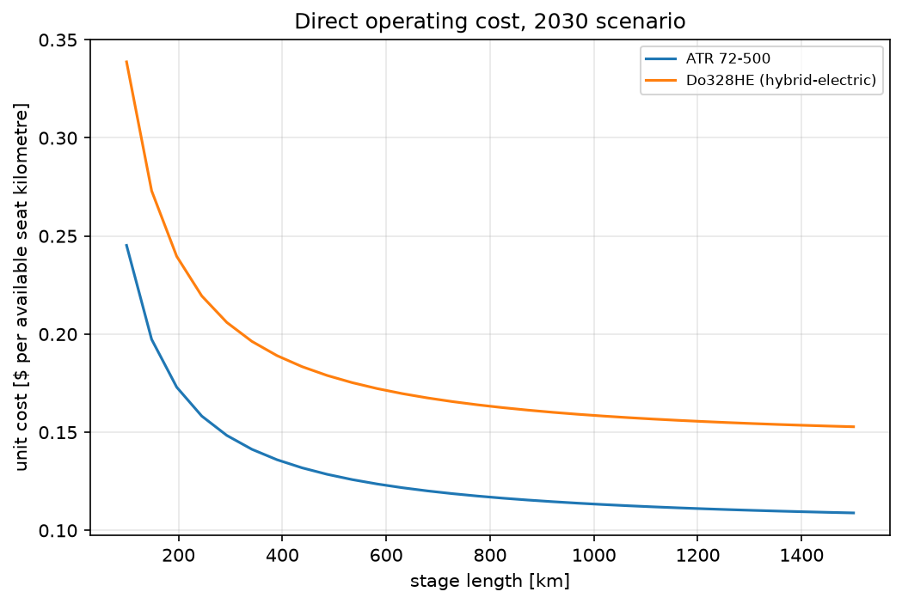
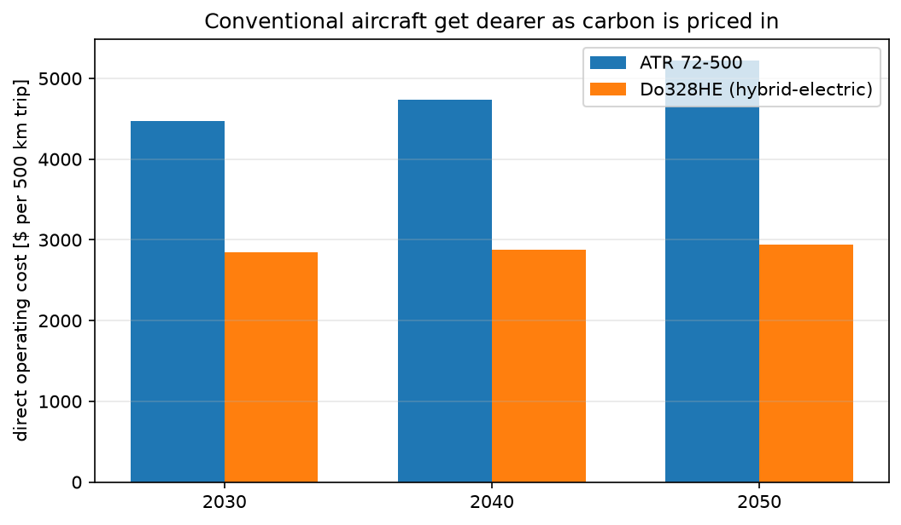

# Step-by-Step Example: Aircraft Cost Estimation

Cost is the constraint most conceptual designs are actually judged against, and the
one students meet last. This example builds four published cost models in OpenMDAO —
three military, one commercial — and wires them into an interactive app so you can
watch a design decision turn into dollars.

The models live in [`../methods/`](../methods/); the equations and their sources are
mapped in [`cost_model_map.md`](cost_model_map.md); the in-class script is
[`ex_04_cost_teaching_guide.md`](ex_04_cost_teaching_guide.md).

> **Teaching note:** unlike [`ex_01`](../../ex_01_asw/docs/ex_01_asw_sizing.md), there
> is no loop here. Cost flows one way, from design parameters to dollars, so the
> OpenMDAO groups are pure feed-forward and need no solver. What they do need is
> *derivatives*, because every interesting question — which parameter drives my unit
> cost, what weight can I afford — is a gradient question.

---

## Learning Objectives

After working through this example, you should be able to:

1. Explain what a cost-estimating relationship is, and why $W_e^{0.777}V^{0.894}Q^{0.163}$
   contains no physics.
2. Distinguish RDT&E, production, operations and life-cycle cost, and distinguish
   programme unit cost from flyaway cost from recurring cost.
3. State the dollar year of any cost you quote, and escalate between years.
4. Use the learning curve to explain why unit cost falls with production quantity and
   where that stops paying.
5. Rank the drivers of acquisition cost and of life-cycle cost, and explain why the
   two rankings differ.
6. Read a published CER critically enough to catch a transcription error in it.
7. Separate the two opposite-signed effects of a material choice on cost.

---

## Run the Interactive App

```bash
conda activate eng-des-opt-course
python -m streamlit run apps/streamlit/cost_app.py
```

Military mode is the default. The commercial direct-operating-cost page is the
second radio option.

---

## The Four Models

| Model | Answers | Source |
|---|---|---|
| **DAPCA IV** + Brandt roll-up | What does the programme cost to develop and build? | Raymer Ch. 18; `Brandt-F16-A.xls` sheet `Cost` |
| **Roskam Part VIII** | What does the whole programme cost, cradle to grave? | Roskam, *Airplane Design Part VIII* |
| **COCOMO II** | What does the software cost? | Boehm |
| **AIAA 2025-3499 DOC** | What does one trip cost an airline? | Espinosa-Juárez et al., AIAA AVIATION 2025 |

Plus a low-observables treatment adder from the Brandt workbook — the one model in
the set where a *geometric* parameter prices straight into dollars.

---

## Step 1 — The Build-Up

DAPCA IV splits acquisition into eight elements: four are labour hours times a wrap
rate, four are direct cost relations.



*Figure: where the money goes on the F-16A at a 200-aircraft buy. Manufacturing labour
and avionics dominate; flight test, the thing that feels expensive, is the smallest bar.*

Every number above is reproduced from `Brandt-F16-A.xls` sheet `Cost` to better than
one part in $10^{9}$, with **one deliberate exception**: the sheet's quality-control
line applies the material factor twice, and this model follows Raymer instead. That
correction moves the four cells downstream of it by 0.14% — see Step 7, and
[`../tests/test_military_cost.py`](../tests/test_military_cost.py), where each constant
carries its spreadsheet cell reference and the correction is applied in one place.

All values in the workbook's own dollars (1999 rates escalated to 2006); the app
reports them in 2026 dollars.

| Quantity | Model | Workbook cell | Workbook |
|---|---|---|---|
| Material factor $D_{47}$ | 1.03 | `D47` | 1.03 |
| Max velocity | 1,145.68 kt | `F12` | 1,145.68 kt |
| Manufacturing hours | 33,502,696 | `C55` | 33,502,696 |
| Acquisition subtotal | $7.853 B | `C72` | $7.864 B |
| Programme total (2006$) | $13.665 B | `C80` | $13.684 B |
| **Unit cost** | **$68.32 M** | `K6` | **$68.42 M** |
| Life O&M per aircraft | $24.84 M | `F111` | $24.84 M |
| **Life-cycle cost** | **$93.17 M** | `F8` | **$93.26 M** |

---

## Step 2 — Seven Ways to Say "The Cost"

This is the section to read twice. Almost every cost argument in a design review is
two people quoting different figures at each other.



*Figure: three of them against production quantity. All three are legitimately
called "unit cost" somewhere in the literature.*

| Figure | What it contains | What it is for | F-16A, Q = 200 |
|---|---|---|---|
| **Recurring unit cost** | Production labour, materials, engines, avionics, signature treatment. | The **marginal** cost of one more airframe — what a follow-on buy costs. | $70.8 M |
| **Average flyaway cost** | Recurring plus tooling. | What a published "flyaway cost" means. **Use this to compare against real aircraft.** | $78.4 M |
| **Programme unit cost** | The whole programme divided by the buy, so it carries all the non-recurring design, test and software cost too. | What the programme costs the customer per tail. Also called procurement unit cost. | $95.9 M |
| **Acquisition unit cost** | Manufacturing plus the manufacturer's profit, divided by the buy. Excludes RDT&E. | Roskam's equivalent of a purchase price: what the production contract is worth per aircraft. | see the *DAPCA vs Roskam* tab |
| **Life-cycle unit cost** | Programme unit cost plus a lifetime of fuel, crew and maintenance. | What owning one aircraft costs cradle to grave. The number that should drive design. | $130.8 M |
| **Total non-recurring** | Design, tooling, flight test and software — spent once, however many you build. | The barrier to entry. Divided by the buy, it is the gap between flyaway and programme unit cost. | $5.03 B |
| **Total programme** | The whole bill: development plus production. | What gets appropriated. | $19.2 B |

Every figure above is in **2026 dollars**, which is what the app reports. The
workbook works in 1999 dollars escalated to 2006; the app escalates from there with
Roskam's cost escalation factor so one chart carries one unit.

> **Teaching note:** published "flyaway cost" means **average flyaway cost**.
> Comparing your *programme* unit cost against a published flyaway cost overstates
> your aircraft by about 20% before you have made a single engineering decision.
> This is the single most common error in student cost charts.

All three per-aircraft figures fall with quantity, because the DAPCA exponents on
$Q$ are less than one — and the saving per extra aircraft shrinks, so "just buy
more" runs out. The *gap* between them closes too: at large quantity the
non-recurring cost is spread thin and the three converge.

Two things land in only one of these figures, and it is worth knowing which:

- **Signature treatment** is *recurring* — every airframe gets coated and taped — so
  it raises recurring, flyaway, programme unit and life-cycle cost alike.
- **Software** is *non-recurring* — the code is written once however many airframes
  are built — so it raises non-recurring, programme unit and life-cycle cost and
  leaves recurring and flyaway cost untouched.

---

## Step 3 — Cost as a Design Constraint



*Figure: programme unit cost over empty weight and production quantity, with the
$85 M budget contour in red. Everything above and to the left of the line is
affordable — lighter airframes and larger buys.*

This is the view that changes how cost is used. Instead of computing a number at the
end of the design and reporting it, the budget becomes a **boundary on the design
space**: at a 500-aircraft buy this aircraft can weigh about 24,000 lb empty; at 200
aircraft it cannot.

---

## Step 4 — Does Any of This Work?

The workbook and paper tests prove the equations were transcribed correctly. A
different question is whether DAPCA IV, pointed at aircraft it was never fitted to,
lands anywhere near reality.



*Figure: model average flyaway cost against published flyaway cost for five real
aircraft, all in 2006 dollars, each at the production quantity actually built.*

| Aircraft | Model | Published (2006$) | Ratio |
|---|---|---|---|
| A-10A Thunderbolt II | $19.4 M | $23.3 M | 0.84 |
| F/A-18E Super Hornet | $61.7 M | $54.0 M | 1.14 |
| F-16A | $23.0 M | $18.1 M | 1.27 |
| F-15C Eagle | $54.1 M | $37.0 M | 1.46 |
| T-38A Talon | $8.0 M | $5.1 M | 1.58 |

Two rules make this comparison fair, and both are the lesson:

1. **Compare flyaway against flyaway.** Using programme unit cost here would put every
   ratio near 2.
2. **Use the quantity actually built.** The Brandt workbook sizes the F-16A programme
   at 200 aircraft; over 4,600 were built. Correcting only that moves the ratio from
   **3.10 to 1.27**. The CERs were never the problem — the assumed quantity was.

> **Where the model stops working:** a factor of two is what a statistical fit to
> 1970s programmes, escalated across four decades, honestly delivers. Eastlake and
> Blackwell found DAPCA IV out by 3× on general-aviation aircraft. Use it to *compare*
> designs, not to quote a price.

---

## Step 5 — Composites: Two Effects, Opposite Signs

**A pound of composite costs more to build than a pound of aluminium.** Raymer says
so — his DAPCA material factors are 1.1–1.8 for graphite-epoxy, 1.1–1.2 for
fibreglass and 1.7–2.2 for titanium, all above the 1.0 for aluminium. Roskam says so
— his $F_{mat}$ runs from 1.0 for conventional alloys to 3.0 for carbon composite.
The two textbooks **agree**.

**But a composite aircraft has fewer pounds.** Raymer applies a separate
empty-weight credit of roughly 5% in the *sizing* chapter, and a lighter aircraft is
cheaper through $W_e$, which appears in every DAPCA CER at an exponent of 0.63 to
0.92.

So the composite decision has two effects of opposite sign, described in two
different chapters, and which one wins depends on the design.

> **Where this model sits.** `ex_04_cost` takes empty weight as an **input**. It
> therefore sees only the first effect — cost per pound — and cannot see the weight
> saving at all. For the full trade, size the aircraft first (see
> [`ex_01`](../../ex_01_asw/docs/ex_01_asw_sizing.md)) and feed the lighter $W_e$ in
> here.

> **And a wrinkle in the workbook.** The Brandt `Cost` sheet's own material table
> uses **0.9** for carbon fibre — *below* aluminium. That is the outlier among the
> three sources, and it appears to net the weight credit into the cost factor. It is
> what reproduces the sheet, so it is the default here; but if you also reduce
> `we_lb` for going composite, you have counted the benefit twice.
> `MATERIAL_FACTORS_RAYMER` in [`../methods/military.py`](../methods/military.py)
> holds Raymer's own values if you want the cost-per-pound effect alone.

---

## Step 6 — The Commercial Side

The same idea, a different question: not what the programme costs, but what one trip
costs an airline. Twelve elements, from AIAA 2025-3499.



*Figure: direct operating cost per available seat kilometre against stage length, 2030
scenario. The collapse with distance is the whole story of regional economics.*

Unit cost falls steeply with stage length because the fixed per-trip charges — landing
fee, a chunk of the crew bill, the ownership charge on a short block time — are spread
over a larger seat-kilometre denominator.



*Figure: the 2030, 2040 and 2050 scenarios. Rising SAF blending and carbon allowance
prices push the conventional ATR the wrong way; the hybrid-electric Do328HE is exempt
from the carbon allowance.*

### Block speed is not cruise speed

The paper does not publish the block-speed or fuel-burn model behind its own results,
so **block time, trip fuel and mission energy are inputs here**. Getting that
assumption wrong is the easiest way to be 40% out:

| Assumption | Block speed | Block time, 1000 km | Unit cost |
|---|---|---|---|
| Table-13 cruise Mach 0.55 × sea-level speed of sound | 674 km/h | 1.48 h | 0.066 $/ASK |
| Published ATR 72-500 block speed | 420 km/h | 2.73 h | **0.113 $/ASK** |
| Paper, Fig. 15, 2030 scenario | — | — | ≈ 0.11 $/ASK |

Turning a cruise Mach into a block speed is wrong twice over: it uses the wrong
altitude for the speed of sound, and block speed includes taxi, climb and descent.
The ATR 72-500 cruises at about 509 km/h and blocks at about 420. That one assumption
is the difference between 40% below the paper and within a few percent of it.

That is why [`../methods/aircraft.py`](../methods/aircraft.py) states block speed and
cruise TAS separately for every aircraft: block speed sets block time, and cruise TAS
sets the equivalent thrust in Eq. 12.

---

## Step 7 — Reading a CER Critically

Two student senior-design programmes were supplied as reference implementations. Both
cite Roskam and Raymer correctly. Both contain transcription errors against them. Each
row below is one line of arithmetic you can check by hand — which is the point.

The table records **every** divergence from a published source in this example, whatever
its origin. In each case the published relation is what the code implements.

| Item | Published | Implemented elsewhere | Effect |
|---|---|---|---|
| Roskam RDT&E engineering man-hours | 0.0396 | 0.03396 | 14.2% understated |
| Roskam RDT&E material weight exponent | 0.689 | 0.686 | 2.9% understated |
| Roskam RDT&E engine + avionics airframes | $N_{rdte} - N_{st} = 6$ | $N_{rdte}\times N_{st} = 16$ | 2.7× overstated |
| Roskam RDT&E engine + avionics price | $C_e N_e + C_{avionics}$ | $0.6\,(C_e N_e + C_{avionics})$ | 40% understated |
| Roskam acquisition cost | $C_{MAN}(1 + F_{pro})$ | $(1 + F_{pro}C_{MAN})$ | share of LCC 1.5% → 23.9% |
| Roskam mission block time | hours (≈2.5) | ≈2.1×10⁶ (units slip) | fuel share 0 → 26.9% |
| Brandt max-velocity conversion | 968.1 / 1.69 | 968.1 / 1.68781 | +0.12% on engineering hours |
| Brandt quality-control hours | $0.133\,H_{mfg}$ | $0.133\,H_{mfg}D_{47}$ | +3.0% on QC hours at $D_{47} = 1.03$ |
| COCOMO II schedule exponent | $0.28 + 0.2(E - B)$ | $0.28$ | schedule 25% short at 200 KSLOC, 40% at 8,000 |
| ATR 72-500 equivalent thrust | $P_{shaft}/V_{cruise}$ = 10.23 kN | 7.73 kN | 32% on the Eq. 12 engine-maintenance term |
| Brandt hinge-line and access-panel RAM | length × rate | length × rate × 2.0 and × 1.25 | +73.7% on those two terms, +19.1% on Level B |

The last row is the one divergence this example **keeps**: it is the Brandt workbook's
own arithmetic and the low-observables model is a reproduction of that sheet, so the
multipliers stay and are documented in
[`cost_model_map.md`](cost_model_map.md#1b-low-observables-treatment-brandt-costa114g167)
instead of being corrected away.

None of these is careless. They are the ordinary failure modes of copying forty
equations out of a book: a digit dropped, a minus read as a times, a unit not
converted. The last one changes nothing that matters; the fourth turns acquisition
from a quarter of the life-cycle cost into a rounding error.

> **Teaching note:** "I copied it out of the book" and "it matches the book" are
> different claims. The only way to tell them apart is to evaluate the relation at a
> point you can check by hand.

---

## Summary of the Method

1. Choose a model and a **dollar year**, and pair the coefficients with the wrap rates
   from that same year.
2. Compute labour hours from empty weight, speed and quantity; multiply by wrap rates.
3. Add the direct cost relations: development support, flight test, materials, engines.
4. Apply the avionics, investment and escalation factors to reach a programme total.
5. Divide by quantity — and **say which of the three per-aircraft numbers you mean**.
6. Add operations and support over the service life to reach life-cycle cost.
7. Sanity-check against a real aircraft at *its* production quantity, comparing like
   with like.

---

## Files

| Path | Contents |
|---|---|
| [`../tests/`](../tests/) | Three test modules, one per source document: the Brandt workbook, the AIAA paper, and Roskam/COCOMO |
| [`../methods/military.py`](../methods/military.py) | DAPCA IV, Brandt roll-up, O&M, low-observables, Roskam Part VIII, COCOMO |
| [`../methods/commercial.py`](../methods/commercial.py) | The twelve DOC elements of AIAA 2025-3499 |
| [`../methods/components.py`](../methods/components.py) | OpenMDAO wrappers with JAX partials |
| [`../methods/group.py`](../methods/group.py) | The three groups and their problem builders |
| [`../methods/config.py`](../methods/config.py) | Input objects, `solve_*`, batch sweeps |
| [`../methods/aircraft.py`](../methods/aircraft.py) | Baseline aircraft and published costs |
| [`../viz/streamlit_page.py`](../viz/streamlit_page.py) | The interactive trade studies |
| [`cost_model_map.md`](cost_model_map.md) | Every equation, with its source |
| [`ex_04_cost_teaching_guide.md`](ex_04_cost_teaching_guide.md) | The in-class script |

## References

- Raymer, D. P., *Aircraft Design: A Conceptual Approach*, Ch. 18.
- Brandt, S. A., et al., *Introduction to Aeronautics: A Design Perspective*, AIAA.
- Roskam, J., *Airplane Design Part VIII: Airplane Cost Estimation*, DARcorporation.
- Boehm, B. W., *Software Engineering Economics*; Boehm et al., *COCOMO II*.
- Espinosa-Juárez, E., Jouannet, C., Amadori, K., & Sánchez Mata, A., "Comparative
  Analysis on Aircraft Direct Operating Cost Models", AIAA AVIATION 2025,
  [10.2514/6.2025-3499](https://doi.org/10.2514/6.2025-3499).
- Eastlake, C. N., & Blackwell, H. W., "Cost Estimating Software for General Aviation
  Aircraft Design", ASEE, 2000.
