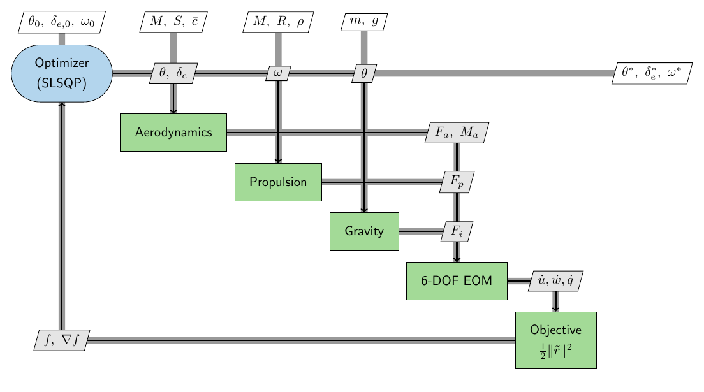

# ex_05 — Cessna-172 six-DOF trim as a gradient-based optimization

A Cessna 172 is trimmed in steady, wings-level flight by driving the rigid-body
accelerations to zero. The same problem is solved with five interchangeable
derivative backends — **numpy** (finite differences), **JAX**, **CasADi**,
**CSDL-alpha**, and **Warp** — and with a gradient-free **pymoo GA**, so the course
can compare how derivatives are produced and what they cost. This is the worked
example for *gradient-based optimization & computing derivatives* (week 3) and for
*gradient-free optimization* (week 6, the GA).

Ported from [`darshansarojini/mdo-jax-examples`](https://github.com/darshansarojini/mdo-jax-examples)
(`jax/c172`), with corrections documented in the [delta table](#delta-table-vs-the-original-repo).

## The model

All physics lives in [`methods/model.py`](../methods/model.py), written generically over
the array module `xp` (numpy or `jax.numpy`); the constants and polynomial
coefficients are in [`methods/aircraft.py`](../methods/aircraft.py) (the single source of
truth for every backend). Atmosphere is `ambiance` at 1000 m.

**Aerodynamics.** The angle of attack and elevator deflection are carried in radians
at the interfaces and converted to degrees for the polynomial fits,
$\alpha_\deg = \tfrac{180}{\pi}\alpha$, $\delta_{e,\deg} = \tfrac{180}{\pi}\delta_e$.
The coefficients are exactly as implemented in
[`methods/aircraft.py`](../methods/aircraft.py) / [`methods/model.py`](../methods/model.py):

$$C_D(\alpha) = 3.3156\times10^{-4}\,\alpha_\deg^{2} + 1.92141\times10^{-3}\,\alpha_\deg + 0.03451242$$

$$C_L(\alpha,\delta_e) = \underbrace{0.09460627\,\alpha_\deg + 0.16531678}_{C_{L,\alpha}}
  + \underbrace{\big({-4.64968867\times10^{-6}}\,\delta_{e,\deg}^{3}
    + 3.95734084\times10^{-6}\,\delta_{e,\deg}^{2}
    + 8.26663557\times10^{-3}\,\delta_{e,\deg}
    - 1.81731015\times10^{-4}\big)}_{C_{L,\delta_e}}$$

$$C_m(\alpha,\delta_e) = \underbrace{{-8.8295\times10^{-4}}\,\alpha_\deg^{2}
    - 1.230759\times10^{-2}\,\alpha_\deg + 1.206867\times10^{-2}}_{C_{m,\alpha}}
  + \underbrace{\big(1.11377133\times10^{-5}\,\delta_{e,\deg}^{3}
    - 9.968957\times10^{-6}\,\delta_{e,\deg}^{2}
    - 2.03797109\times10^{-2}\,\delta_{e,\deg}
    + 1.37160466\times10^{-4}\big)}_{C_{m,\delta_e}}$$

Side force, rolling, and yawing coefficients are zero ($C_Y = C_l = C_n = 0$) at this
symmetric, zero-sideslip condition. With dynamic pressure $q = \tfrac12\rho V^2$ and
$V = M a$, the dimensional lift, drag, and pitching moment are

$$L = q\,S\,C_L,\qquad D = q\,S\,C_D,\qquad \mathcal{M} = q\,S\,\bar c\,C_m,$$

and the standard wind→body rotation (zero sideslip) gives the body-axis forces

$$F_{x,\text{aero}} = -D\cos\alpha + L\sin\alpha,\qquad
  F_{z,\text{aero}} = -D\sin\alpha - L\cos\alpha,$$

with the pitching moment $\mathcal{M}$ about the body $y$-axis (and zero roll/yaw moment).

**Propulsion** (corrected — see the delta table):

$$J = \frac{\pi V}{\omega_{\text{rad}} R},\quad C_T = -0.1692 J^2 + 0.0355 J + 0.1045,\quad
  T = \left(\tfrac{2}{\pi}\right)^2 \rho\, \omega_{\text{rad}}^2 R^4\, C_T$$

**Gravity** (body axes, φ = 0): $F_{x,i} = -mg\sin\theta$, $F_{z,i} = mg\cos\theta$.

**Trim.** With α = θ, u = V cos α, w = V sin α, and v = p = q = r = φ = ψ = 0, the
6-DOF equations of motion reduce to three active residuals
$(\dot u, \dot w, \dot q) = (F_x/m,\ F_z/m,\ M/I_{yy})$. The optimizer minimizes

$$f(\theta,\delta_e,\omega) = \tfrac12\,\lVert \tilde r\rVert^2,\qquad
  \tilde r = [\dot u,\dot v,\dot w,\dot p,\dot q,\dot r] / (g,g,g,1,1,1).$$

Design variables are laid out in blocks `[θ(N) | δ_e(N) | ω(N)]` and scaled to
`z ∈ [0,1]` by their bounds (θ∈[−10°,15°], δ_e∈[−15°,15°], ω∈[1000,2800] RPM); see
[`methods/problem.py`](../methods/problem.py). For `N` trim nodes the Mach schedule is
`M = 0.117` (N=1) or `linspace(0.10, 0.17, N)` (N≥2).

### XDSM



The optimizer owns the design variables and *replaces* the nonlinear solver used in
the ASW sizing example — trim is posed directly as optimization.

## Backends

| Backend | File | Derivatives | Device here |
|---|---|---|---|
| numpy | [`backend_numpy.py`](../methods/backend_numpy.py) | finite difference (via `CountingObjective`) | CPU |
| JAX | [`backend_jax.py`](../methods/backend_jax.py) | `jax.grad` (reverse) | CPU* |
| CasADi | [`backend_casadi.py`](../methods/backend_casadi.py) | symbolic `ca.gradient`, `.map(N)` | CPU |
| CSDL-alpha | [`backend_csdl.py`](../methods/backend_csdl.py) | recorder graph + `PySimulator` | CPU |
| Warp | [`backend_warp.py`](../methods/backend_warp.py) | `wp.Tape` reverse, `atomic_add` | **GPU (cuda:0)** |

\*JAX has no native-Windows GPU wheels, so it runs on CPU here; Warp bundles its CUDA
runtime and reaches the RTX 4060. The device is recorded per study row; there is no
CPU-vs-GPU benchmark axis. On a consumer GeForce, FP64 ≈ 1/64 FP32 and the model runs
float64 for parity, so Warp-on-GPU is correct but not necessarily faster at this scale.

All exact-gradient backends agree to machine precision and therefore take the
**identical SLSQP path** (same iteration and evaluation counts) — a central teaching
point.

## Delta table vs. the original repo

The port is faithful to `mdo-jax-examples` except for these deliberate corrections
(the originals are preserved in `references/mdo-jax-examples/` for comparison):

| Item | Original | This port | Why |
|---|---|---|---|
| Propeller thrust | `T ∝ (ωR)²` (R², all backends) | `T ∝ ω² R⁴` | `T = C_T ρ n² D⁴` with D = 2R, n = ω/2π; the R² form is dimensionally wrong |
| Body-force DCM | `jax`, `casadi` transpose the wind→body DCM → `Fx = −D cosα − L sinα` | standard `Fx = −D cosα + L sinα`, `Fz = −D sinα − L cosα` (as `warp`, `csdl`) | the transposed DCM sits at a different operating point (δ_e ≈ −36°) |
| δ_e² aero terms | `nvidia_warp` zeroed the `CL`/`Cm` quadratic-in-δ_e coefficients | restored full cubic δ_e fits | parity across backends |
| Precision | `nvidia_warp` used float32 | float64 everywhere | parity / accurate gradients |
| Objective | unsquared, unscaled `‖residual‖` | `½‖r̃‖²`, scaled by (g,g,g,1,1,1) | smooth, well-conditioned least squares |
| Atmosphere | hard-coded 1000 m ISA constants | `ambiance` at 1000 m | removes magic numbers (agrees < 1e-6 rel) |
| DV assembly | JAX `hstack`/`reshape` | explicit block layout + pack/unpack | clearer, backend-agnostic |

**Corrected trim at M = 0.1 (N = 1):** θ = 9.505408°, δ_e = −9.581727°,
ω = 1823.38 RPM. (With the original R² thrust bug, ω = 1760.84 RPM; θ and δ_e are
unchanged because thrust is body-x only with zero moment arm.)

## Running

From the repository root, with the `eng-des-opt-course` environment active:

```bash
# tests (optional backends auto-skip if not installed)
python -m unittest discover -s src/aircraft_sizing/examples/ex_05_c172_trim/tests

# the full benchmark study: CSVs -> docs/assets/data, figures -> docs/assets/images
python -m aircraft_sizing.examples.ex_05_c172_trim.methods.study            # standard
python -m aircraft_sizing.examples.ex_05_c172_trim.methods.study --quick     # fast

# a small live comparison of every available method
python src/aircraft_sizing/examples/ex_05_c172_trim/docs/ex_05_c172_trim_demo.py

# re-render the XDSM (needs pdflatex + pdftoppm)
python -m aircraft_sizing.examples.ex_05_c172_trim.viz.xdsm.c172_trim_xdsm
```

The optional backends install with the `trim` and `csdl` extras: `pip install -e .[trim,csdl]`.
Warp works on native Windows with just the NVIDIA driver (its wheel ships the CUDA
runtime); JAX stays on CPU (do **not** install `jax[cuda]` on Windows).

## Study outputs

- [`assets/data/scaling.csv`](assets/data/scaling.csv) — iterations, evals, split
  timings, device, and error-vs-reference per backend/derivative method and node count.
- [`assets/data/gradient_per_call.csv`](assets/data/gradient_per_call.csv) — per-call
  analytic gradient time vs. problem size.
- [`assets/data/formulation.csv`](assets/data/formulation.csv) — SLSQP iteration count
  for three formulations of the same trim (½‖r‖² vs. ‖r‖ vs. equality-constrained).
- Figures in [`assets/images/`](assets/images/): trim schedule, scaling, per-call cost.
